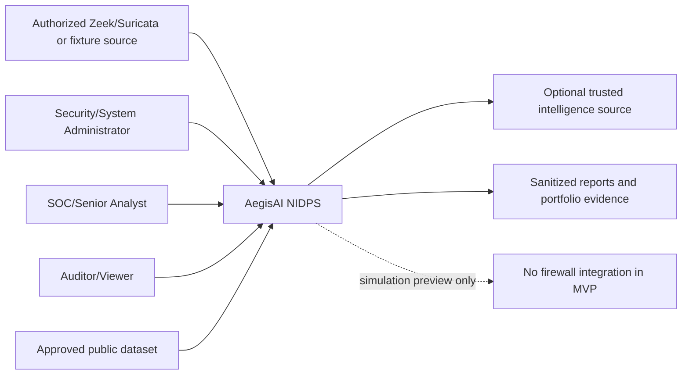

# System Architecture

**Status:** Approved; Sprint 1 identity, Sprint 2 ingestion, and Sprint 3 deterministic detection/alert boundaries implemented; later components remain proposed

## Architectural style

A modular monorepo with independently testable service modules, one FastAPI application boundary, one background worker boundary, and one TypeScript web application is recommended for the MVP. PostgreSQL is the system of record; Redis is a queue/cache dependency, not authoritative storage. Service separation is logical first; premature deployment as many microservices is avoided.

## Context

## Runtime containers

| Container | Purpose | Inputs/outputs | Failure behavior | Key controls/tests |
|---|---|---|---|---|
| Dashboard | Analyst/admin UI | REST and WebSocket | Shows bounded error/degraded state | CSP, encoding, accessibility, RBAC UX; server remains authority |
| API | Auth, validation, orchestration, queries | HTTPS/JSON | Stable errors; no stack traces | Schemas, RBAC, rate limits, audit, correlation IDs |
| Worker | Offline parsing, normalization, replay, deterministic detection, retention; later reports/inference | Queue job/run UUID; controlled DB/object references; canonical DB rows | Retry bounded/idempotent; safe failed state | Non-root/read-only, CPU/memory/PID/time/record/group/signal limits, replay/fuzz/rule tests |
| Scheduler | Enqueue raw/flow retention work | Registered task names only | Missed cleanup is visible through expiry/metrics | JSON-only tasks, least privilege, bounded resources |
| PostgreSQL | Authoritative transactional state | SQL | API fails closed for sensitive writes | Constraints, migrations, least privilege, backup plan |
| Redis | Queue/cache/short-lived coordination | Bounded messages | Degraded async service; never authoritative | Authentication/network isolation, TTLs, queue limits |
| Monitoring | Metrics/dashboards after later sprint | Scraped metrics | Does not control detections | No secrets/labels with excessive cardinality |

## Logical components

| Component | Responsibility | Must not do |
|---|---|---|
| Identity/RBAC | Authenticate and authorize users/sensors | Trust frontend permissions |
| Ingestion | Validate source and normalize canonical telemetry | Execute uploads or decide maliciousness |
| Signature detection | Normalize Suricata evidence | Directly enforce actions |
| Behavioral rules | Deterministic time-window detections | Hide thresholds or versions |
| Feature engineering | Shared deterministic transforms | Read ground-truth labels at inference |
| Training | Reproducible experiments and evaluation | Serve production requests or use test data for tuning |
| ML inference | Compatible artifact scoring | Activate models or call prevention |
| Anomaly detection | Produce anomaly score/uncertainty | Label every anomaly malicious |
| Ensemble | Fuse evidence and document risk | Grant action authorization |
| Intelligence | Normalize expiring indicators | Treat stale/single-source match as proof |
| Explainability | Describe contributions/evidence | Claim causation |
| Alert management | State machine, notes, assignment | Mutate evidence provenance |
| Incident management | Group alerts and maintain timeline | Delete original alert evidence |
| Prevention policy | Deterministically evaluate eligibility | Execute system commands |
| Simulation adapter | Record previews/status | Modify firewall/network state |
| Audit | Append security-relevant events | Store credentials or mutable business state only |
| Reporting | Generate authorized/redacted output | Bypass field/role restrictions |

## Trust boundaries and zones

1. **Untrusted source zone:** uploads, sensor messages, datasets, intelligence responses.
2. **Presentation zone:** browser and dashboard; all values remain untrusted to the API.
3. **Application zone:** API and worker with distinct least-privilege identities.
4. **Data zone:** PostgreSQL and Redis on a private container network.
5. **Artifact zone:** controlled datasets/models/reports with provenance and access policy.
6. **Future enforcement zone:** explicitly absent from MVP; later adapters require a separate lab boundary.

## Key interfaces

- `TelemetryAdapter.parse(source) -> CanonicalFlowV1[] | controlled rejection`
- `FeaturePipeline.transform(events, schema_version) -> FeatureVector[]`
- `Detector.evaluate(context) -> DetectionSignal[]`
- `Ensemble.score(signals, asset_context) -> DecisionAssessment`
- `PreventionPolicy.evaluate(request, evidence, context) -> GateDecision[]`
- `PreventionAdapter.validate/preview/execute/verify/rollback/status`

For the MVP, only a simulation adapter exists. Its `execute` operation persists a simulated outcome and performs no OS/network call.

## Authentication and authorization

The API is the policy enforcement point. A centralized permission service evaluates subject, action, resource, and relevant attributes. Authentication uses an opaque server-side session ID in a `Secure`, `HttpOnly`, `SameSite=Lax` cookie. Unsafe HTTP methods require a CSRF token bound to the session plus Origin validation. Sessions rotate after login and privilege changes and are revoked server-side. The React/Vite client never stores bearer credentials in browser storage. Asset criticality, raw telemetry access, model activation, rule/threshold change, export, and simulation review receive explicit permissions.

## Messaging and idempotency

Queue messages carry only an ingestion-job or detection-run UUID—not secrets, object paths, metadata, evidence, or payloads. Workers resolve authoritative rows from PostgreSQL, validate again, commit atomically, and use bounded retries. Poison work becomes a reviewable failed row with a sanitized code rather than retrying indefinitely.

The upload data path is: authenticated user/sensor → API body/rate/content cap → opaque `0700` artifact object plus SHA-256/DB job → JSON-only Celery UUID → strict adapter → canonical v1 validation → idempotency ledger and flow rows → immediate raw deletion. Replay reads previously normalized flows and never depends on retained raw bytes. Live interface capture is not an interface in Sprint 2.

The Sprint 3 path is: successful ingestion → persisted run → JSON-only run UUID → bounded active immutable rule set plus canonical signatures → stable signals → versioned alert fingerprint/evidence → PostgreSQL commit → minimal Redis notification. Fixed event-time windows make evaluation deterministic. Exact reruns are no-ops; material late evidence remains append-oriented. WebSocket clients receive only IDs through bounded queues and fall back to REST polling.

## Failure and degraded behavior

- Database unavailable: reject state-changing operations; serve only explicitly safe cached health information.
- Redis unavailable: accept no untrackable asynchronous job; expose degraded health.
- Model unavailable/incompatible: deterministic detections continue; model signal is absent and recorded.
- Intelligence unavailable: detections continue without enrichment; no stale elevation to prevention.
- WebSocket unavailable: polling remains possible; alert persistence is authoritative.
- Audit persistence failure: fail closed for high-sensitivity administrative/policy changes.

## Scaling approach

MVP scaling uses chunked processing, bounded queues, worker concurrency, database indexes/partition review, pagination, alert suppression, and WebSocket fan-out limits. No numeric capacity claim is approved until representative load testing.

## Secrets

Development uses ignored environment configuration; CI uses platform secret storage. Secrets are never placed in images, fixtures, URLs, logs, audit payloads, or client bundles. Rotation and sensor-credential display rules are documented before Sprint 1.

## Architecture invariants

1. Simulation is the only prevention adapter in Sprints 0–9.
2. Detection, policy, and adapter boundaries are unidirectional.
3. PostgreSQL is authoritative.
4. Training and inference are separated.
5. Schemas, rules, features, thresholds, datasets, and artifacts are versioned.
6. Raw input remains untrusted across every boundary.
7. Sensitive state changes require authorization and audit.

## Deferred architectural decision

React/Vite, Celery, cookie sessions, controlled local artifact storage, repository/license, retention, and development-host constraints are approved. Only artifact serialization format remains open in `docs/DECISIONS.md`; it blocks model work, not the current foundation.
