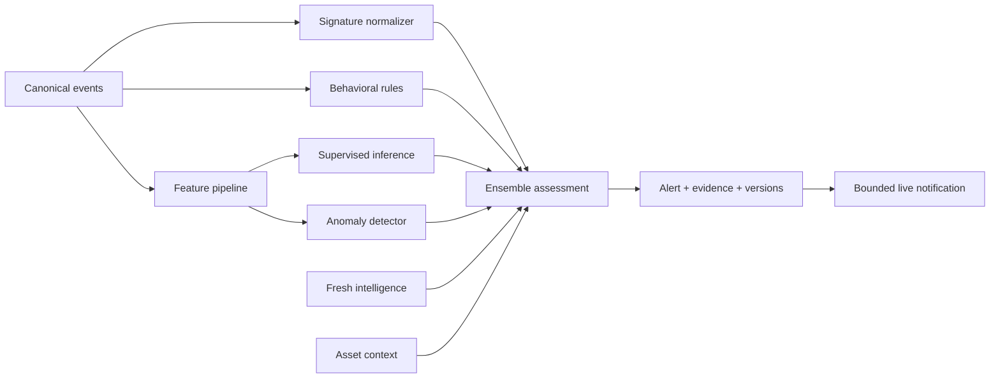
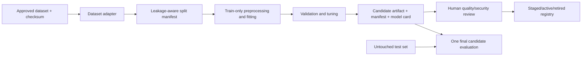

# Data Flows and Trust Boundaries

## DF-01 Telemetry ingestion

```mermaid
sequenceDiagram
  participant S as Authorized source/user
  participant A as API
  participant Q as Queue
  participant W as Worker
  participant D as PostgreSQL
  S->>A: Authenticated upload or event reference
  A->>A: Authorize, validate envelope and limits
  A->>D: Create ingestion job and audit event
  A->>Q: Enqueue bounded job reference
  W->>Q: Claim job
  W->>W: Validate content/schema; normalize; deduplicate
  W->>D: Persist canonical events and status
  W->>D: Persist safe metrics/errors
```

Trust controls: content validation, internal filenames, isolated storage, size/decompression/time/memory limits, schema version, checksum, idempotency, bounded retries, non-sensitive errors.

## DF-02 Detection and alert creation



The ensemble returns assessment, not enforcement authorization. Missing ML/intelligence is explicit and does not halt deterministic detection.

## DF-03 Training and model promotion



Ground-truth labels never enter inference features. Activation is audited; rollback target remains available. Model promotion cannot alter prevention policy.

## DF-04 Analyst investigation

Browser requests are authenticated and authorized at the API. The API loads redacted alert, evidence, explanation, and history. State changes pass a server-side transition check, optimistic concurrency/version check, and audit write. WebSocket messages contain minimal identifiers and summaries; clients fetch authorized detail.

## DF-05 Prevention simulation

```mermaid
sequenceDiagram
  participant U as Authorized analyst
  participant A as API
  participant P as Policy engine
  participant S as Simulation adapter
  participant D as PostgreSQL/Audit
  U->>A: Request simulation with idempotency key
  A->>A: Authorize and validate
  A->>P: Evidence, target, asset, environment, policy version
  P-->>A: Passed/failed gates and reasons
  A->>S: Validate and preview eligible proposal
  S-->>A: Safe representation; no OS action
  A->>D: Request, gates, preview, expiry, rollback metadata, simulated result
  A-->>U: Simulation result
```

Invariant: no firewall binary, socket, API credential, privileged container, or host network capability is present in the MVP path.

## Data classification

| Data | Classification | Primary controls |
|---|---|---|
| Passwords/tokens/sensor secrets | Restricted | Hash/encrypt as appropriate, never log/export |
| Raw PCAP/payload | Restricted | Disabled/default-minimized, access and retention controls |
| IP/domain/flow metadata | Sensitive | RBAC, retention, sanitized demos/exports |
| Alerts/incidents/notes | Sensitive | RBAC, audit, integrity, retention |
| Models/datasets/features | Controlled | Provenance, checksum, access, versioning |
| Audit records | High-integrity sensitive | Append-oriented access, restricted export, backup |
| Public docs/sanitized screenshots | Public | Review/redaction before publication |

## Approved core development retention

- Uploaded raw files: delete immediately after successful processing or within 24 hours, whichever occurs first; failed quarantined jobs also expire by 24 hours unless explicitly preserved in an authorized investigation.
- Canonical flow metadata: 30 days in development.
- Alerts/incidents/audit: 180 days in development or until portfolio evidence is exported.
- Failed job details: 30 days, without raw secrets/payloads.
- Model/dataset manifests and reports: retained by version; raw datasets remain outside Git.

Flow, alert, and audit periods are approved for development. Incident notes, reports, predictions, and exceptional legal/incident holds remain unresolved in `docs/DECISIONS.md`.
