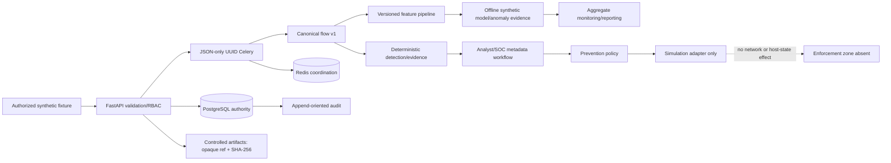

# Portfolio Architecture Overview

## Trust boundaries

1. Browser and fixture inputs are untrusted.
2. FastAPI validates, authorizes, applies CSRF/Origin rules, and writes audit
   records; the frontend is never the authorization boundary.
3. Celery receives only JSON UUID references and resolves authoritative rows.
4. PostgreSQL is authoritative. Redis is disposable coordination.
5. Controlled artifacts use opaque references and SHA-256 integrity.
6. The enforcement zone is intentionally absent. The only prevention adapter
   records a simulation result.

## Portfolio-specific boundaries

- Monitoring and reports read accepted synthetic/offline metadata and emit
  aggregate-only results.
- Analyst feedback is an audited observation, not ground truth and not a
  training/promotion channel.
- The sealed test remains closed for P5.
- Demo materials are controlled artifacts and require separate publication
  approval.
